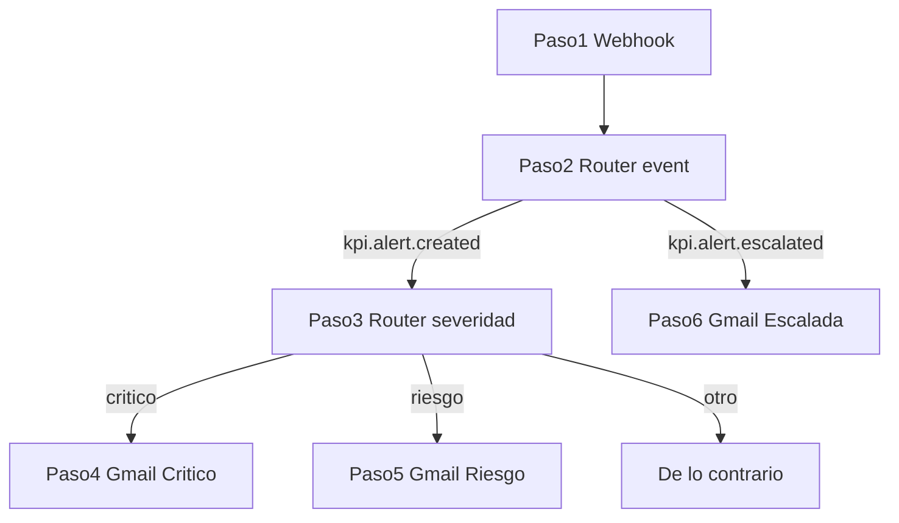

# Guía Activepieces — Alertas KPI (HU-KPI-008)

Documento único con todas las estructuraciones de alertas, en el **orden de pasos del flow** en Activepieces.

## Índice

| Paso | Pieza | Evento / condición |
|------|-------|-------------------|
| [1](#paso-1--capturar-webhook) | Capturar Webhook | Recibe todos los eventos |
| [2](#paso-2--router-principal) | Router | `kpi.alert.created` o `kpi.alert.escalated` |
| [3](#paso-3--router-severidad-solo-rama-alerta-creada) | Router interno | `body.severidad` → `critico` / `riesgo` |
| [4](#paso-4--gmail-crítico) | Gmail | Rama **Crítico** |
| [5](#paso-5--gmail-riesgo) | Gmail | Rama **Riesgo** |
| [6](#paso-6--gmail-escalada) | Gmail | Rama **Alerta escalada** |
| [—](#errores-muy-comunes) | — | Errores comunes |
| [—](#prueba-end-to-end) | — | Prueba end-to-end |

## Resumen de ramas

| Rama en Activepieces | Evento | Correos |
|----------------------|--------|---------|
| **Alerta creada** | `kpi.alert.created` | Paso 4 (crítico) o Paso 5 (riesgo) |
| **Alerta escalada** | `kpi.alert.escalated` | Paso 6 |



---

## Paso 1 — Capturar Webhook

Piensa en el paso 1 como un **buzón con dirección**:

- La **URL** es la dirección del buzón.
- Cuando la app (o tú desde consola) envía un JSON, Activepieces lo guarda en `body`.
- Los campos **no aparecen** hasta que envías datos a esa URL.

| Tipo | Ejemplo |
|------|---------|
| URL viva | `https://cloud.activepieces.com/api/v1/webhooks/H9xxxxx` |
| URL test | `https://cloud.activepieces.com/api/v1/webhooks/H9xxxxx/test` |

### Cómo cargar datos de prueba

1. **Publicar** el flow (o usar URL `/test`).
2. Ejecutar el PowerShell del paso que quieras probar.
3. Ver el `body` en el paso 1 o en **Runs** → última ejecución.

---

## Paso 2 — Router principal

Añade la pieza **Router** conectada al paso 1. Ramas por `body.event`:

| Rama | Condición exacta | Siguiente paso |
|------|------------------|----------------|
| **Alerta creada** | `body.event` igual a `kpi.alert.created` | Paso 3 (Router severidad) |
| **Alerta escalada** | `body.event` igual a `kpi.alert.escalated` | Paso 6 (Gmail) |

---

## Paso 3 — Router severidad (solo rama Alerta creada)

Dentro de la rama **Alerta creada** del paso 2, añade un **segundo Router**:

| Sub-rama | Condición exacta | Siguiente paso |
|----------|------------------|----------------|
| **Crítico** | `body.severidad` igual a `critico` | Paso 4 |
| **Riesgo** | `body.severidad` igual a `riesgo` | Paso 5 |
| **De lo contrario** | (fallback) | Sin correo, o Gmail genérico |

### Evento: `kpi.alert.created`

**Cuándo se dispara:** al registrarse un valor KPI en **riesgo** o **incumplimiento**.

### Payload

| Campo | Ejemplo | Uso |
|-------|---------|-----|
| `event` | `kpi.alert.created` | Router paso 2 |
| `timestamp` | ISO 8601 | Pie del correo |
| `alertId` | UUID | Trazabilidad |
| `kpiId` | UUID | Contexto |
| `hotelId` | UUID | Contexto |
| `severidad` | `critico` / `riesgo` | Router paso 3 |
| `mensaje` | Texto descriptivo | Cuerpo del correo |

Ejemplo de `mensaje`:

```
KPI "Conversión web" en estado incumplimiento — Estelar Cartagena. Valor: 2.1, Meta: 2.5, Cumplimiento: 84%
```

> **Nota:** algunos sync batch envían `{ type, count }` sin `severidad`. Esos casos caen en **De lo contrario**.

### PowerShell — probar Crítico (activa paso 4)

```powershell
$url = "https://cloud.activepieces.com/api/v1/webhooks/TU_ID_AQUI/test"
$body = @'
{
  "event": "kpi.alert.created",
  "timestamp": "2026-06-24T10:00:00.000Z",
  "alertId": "alert-001",
  "kpiId": "kpi-001",
  "hotelId": "hotel-001",
  "severidad": "critico",
  "mensaje": "KPI \"Conversión web\" en estado incumplimiento — Estelar Cartagena. Valor: 2.1, Meta: 2.5, Cumplimiento: 84%"
}
'@
Invoke-RestMethod -Uri $url -Method POST -ContentType "application/json" -Body $body
```

### PowerShell — probar Riesgo (activa paso 5)

Mismo comando; cambia:

```json
"severidad": "riesgo",
"mensaje": "KPI \"Ocupación\" en estado riesgo — Estelar Bogotá. Valor: 72, Meta: 80, Cumplimiento: 90%"
```

---

## Paso 4 — Gmail Crítico

Rama **Crítico** del paso 3. Destinatario: correo fijo de alta prioridad (director).

### Texto plano

| Campo | Qué poner |
|-------|-----------|
| **Para** | Correo director / alta prioridad (fijo) |
| **Asunto** | `ALERTA CRÍTICA KPI — revisión inmediata` |
| **Cuerpo** | `body` → `mensaje` + enlace `https://tu-app.vercel.app/alertas` |

### Plantilla HTML

Tipo de cuerpo: **HTML**. Encabezado rojo (`#991b1b`). Mapea campos desde `1. Capturar Webhook` → `body`.

```html
<!DOCTYPE html>
<html lang="es">
<head>
  <meta charset="UTF-8">
  <meta name="viewport" content="width=device-width, initial-scale=1.0">
</head>
<body style="margin: 0; padding: 0; background-color: #f1f5f9; font-family: Arial, Helvetica, sans-serif;">
  <table role="presentation" width="100%" cellspacing="0" cellpadding="0" style="background-color: #f1f5f9; padding: 32px 16px;">
    <tr>
      <td align="center">
        <table role="presentation" width="600" cellspacing="0" cellpadding="0" style="max-width: 600px; background-color: #ffffff; border-radius: 8px; overflow: hidden; box-shadow: 0 2px 8px rgba(0,0,0,0.06);">
          <tr>
            <td style="background-color: #991b1b; padding: 24px 32px;">
              <p style="margin: 0; color: #fecaca; font-size: 12px; letter-spacing: 1px; text-transform: uppercase;">Sistema KPIs Estelar</p>
              <h1 style="margin: 8px 0 0; color: #ffffff; font-size: 20px; font-weight: bold;">Alerta crítica</h1>
            </td>
          </tr>
          <tr>
            <td style="padding: 32px;">
              <table role="presentation" width="100%" cellspacing="0" cellpadding="0" style="background-color: #fef2f2; border-left: 4px solid #991b1b; margin-bottom: 24px;">
                <tr>
                  <td style="padding: 16px 20px; color: #7f1d1d; font-size: 14px; line-height: 1.6; font-weight: bold;">
                    SEVERIDAD: CRÍTICO — Requiere acción inmediata
                  </td>
                </tr>
              </table>
              <p style="margin: 0 0 24px; color: #334155; font-size: 15px; line-height: 1.6;">
                {{step_1.body.mensaje}}
              </p>
              <table role="presentation" width="100%" cellspacing="0" cellpadding="0" style="border: 1px solid #e2e8f0; border-radius: 6px; margin-bottom: 28px;">
                <tr style="background-color: #f8fafc;">
                  <td style="padding: 12px 16px; color: #64748b; font-size: 13px; width: 120px; font-weight: bold;">Alerta</td>
                  <td style="padding: 12px 16px; color: #1e293b; font-size: 12px; font-family: monospace;">{{step_1.body.alertId}}</td>
                </tr>
                <tr>
                  <td style="padding: 12px 16px; color: #64748b; font-size: 13px; font-weight: bold;">Severidad</td>
                  <td style="padding: 12px 16px; color: #991b1b; font-size: 14px; font-weight: bold; text-transform: uppercase;">{{step_1.body.severidad}}</td>
                </tr>
              </table>
              <table role="presentation" cellspacing="0" cellpadding="0">
                <tr>
                  <td style="border-radius: 6px; background-color: #991b1b;">
                    <a href="https://tu-app.vercel.app/alertas"
                       target="_blank"
                       style="display: inline-block; padding: 14px 28px; color: #ffffff; font-size: 14px; font-weight: bold; text-decoration: none;">
                      Revisar alerta →
                    </a>
                  </td>
                </tr>
              </table>
            </td>
          </tr>
          <tr>
            <td style="background-color: #f8fafc; padding: 16px 32px; border-top: 1px solid #e2e8f0;">
              <p style="margin: 0; color: #94a3b8; font-size: 11px; text-align: center;">
                Notificación automática · {{step_1.body.timestamp}}<br>
                No responda a este correo.
              </p>
            </td>
          </tr>
        </table>
      </td>
    </tr>
  </table>
</body>
</html>
```

---

## Paso 5 — Gmail Riesgo

Rama **Riesgo** del paso 3. Destinatario: correo fijo de operaciones.

### Texto plano

| Campo | Qué poner |
|-------|-----------|
| **Para** | Correo operaciones (fijo) |
| **Asunto** | `Alerta KPI en riesgo — seguimiento` |
| **Cuerpo** | `body` → `mensaje` + enlace `https://tu-app.vercel.app/alertas` |

### Plantilla HTML

Encabezado ámbar (`#b45309`).

```html
<!DOCTYPE html>
<html lang="es">
<head>
  <meta charset="UTF-8">
  <meta name="viewport" content="width=device-width, initial-scale=1.0">
</head>
<body style="margin: 0; padding: 0; background-color: #f1f5f9; font-family: Arial, Helvetica, sans-serif;">
  <table role="presentation" width="100%" cellspacing="0" cellpadding="0" style="background-color: #f1f5f9; padding: 32px 16px;">
    <tr>
      <td align="center">
        <table role="presentation" width="600" cellspacing="0" cellpadding="0" style="max-width: 600px; background-color: #ffffff; border-radius: 8px; overflow: hidden; box-shadow: 0 2px 8px rgba(0,0,0,0.06);">
          <tr>
            <td style="background-color: #b45309; padding: 24px 32px;">
              <p style="margin: 0; color: #fef3c7; font-size: 12px; letter-spacing: 1px; text-transform: uppercase;">Sistema KPIs Estelar</p>
              <h1 style="margin: 8px 0 0; color: #ffffff; font-size: 20px; font-weight: bold;">Alerta en riesgo</h1>
            </td>
          </tr>
          <tr>
            <td style="padding: 32px;">
              <table role="presentation" width="100%" cellspacing="0" cellpadding="0" style="background-color: #fffbeb; border-left: 4px solid #b45309; margin-bottom: 24px;">
                <tr>
                  <td style="padding: 16px 20px; color: #92400e; font-size: 14px; line-height: 1.6;">
                    Severidad: riesgo — Seguimiento recomendado
                  </td>
                </tr>
              </table>
              <p style="margin: 0 0 24px; color: #334155; font-size: 15px; line-height: 1.6;">
                {{step_1.body.mensaje}}
              </p>
              <table role="presentation" width="100%" cellspacing="0" cellpadding="0" style="border: 1px solid #e2e8f0; border-radius: 6px; margin-bottom: 28px;">
                <tr style="background-color: #f8fafc;">
                  <td style="padding: 12px 16px; color: #64748b; font-size: 13px; width: 120px; font-weight: bold;">Alerta</td>
                  <td style="padding: 12px 16px; color: #1e293b; font-size: 12px; font-family: monospace;">{{step_1.body.alertId}}</td>
                </tr>
                <tr>
                  <td style="padding: 12px 16px; color: #64748b; font-size: 13px; font-weight: bold;">Severidad</td>
                  <td style="padding: 12px 16px; color: #b45309; font-size: 14px; font-weight: bold; text-transform: uppercase;">{{step_1.body.severidad}}</td>
                </tr>
              </table>
              <table role="presentation" cellspacing="0" cellpadding="0">
                <tr>
                  <td style="border-radius: 6px; background-color: #b45309;">
                    <a href="https://tu-app.vercel.app/alertas"
                       target="_blank"
                       style="display: inline-block; padding: 14px 28px; color: #ffffff; font-size: 14px; font-weight: bold; text-decoration: none;">
                      Ver alertas →
                    </a>
                  </td>
                </tr>
              </table>
            </td>
          </tr>
          <tr>
            <td style="background-color: #f8fafc; padding: 16px 32px; border-top: 1px solid #e2e8f0;">
              <p style="margin: 0; color: #94a3b8; font-size: 11px; text-align: center;">
                Notificación automática · {{step_1.body.timestamp}}<br>
                No responda a este correo.
              </p>
            </td>
          </tr>
        </table>
      </td>
    </tr>
  </table>
</body>
</html>
```

---

## Paso 6 — Gmail Escalada

Rama **Alerta escalada** del paso 2 (no pasa por el Router del paso 3).

### Evento: `kpi.alert.escalated`

**Cuándo se dispara:**

- Usuario pulsa **Escalar** en `/alertas`.
- Alerta crítica creada ya escalada automáticamente.
- Cron `GET /api/cron/escalate-alerts` — alertas sin plan tras 48 h.

### Payload — variante A (individual)

| Campo | Ejemplo |
|-------|---------|
| `alertId` | UUID |
| `kpiId` | UUID |
| `mensaje` | Texto de la alerta |
| `severidad` | `critico` / `riesgo` |

### Payload — variante B (masivo automático)

| Campo | Ejemplo |
|-------|---------|
| `autoEscalated` | `true` |
| `count` | `3` |

### PowerShell — individual

```powershell
$url = "https://cloud.activepieces.com/api/v1/webhooks/TU_ID_AQUI/test"
$body = @'
{
  "event": "kpi.alert.escalated",
  "timestamp": "2026-06-24T10:00:00.000Z",
  "alertId": "alert-002",
  "kpiId": "kpi-001",
  "mensaje": "KPI \"Conversión web\" en estado incumplimiento — Estelar Cartagena. Valor: 2.1, Meta: 2.5, Cumplimiento: 84%",
  "severidad": "critico"
}
'@
Invoke-RestMethod -Uri $url -Method POST -ContentType "application/json" -Body $body
```

### PowerShell — masivo automático

```powershell
$url = "https://cloud.activepieces.com/api/v1/webhooks/TU_ID_AQUI/test"
$body = @'
{
  "event": "kpi.alert.escalated",
  "timestamp": "2026-06-24T07:00:00.000Z",
  "autoEscalated": true,
  "count": 3
}
'@
Invoke-RestMethod -Uri $url -Method POST -ContentType "application/json" -Body $body
```

### Texto plano

| Campo | Qué poner |
|-------|-----------|
| **Para** | Director comercial / lista de escalamiento (fijo) |
| **Asunto (individual)** | `ESCALAMIENTO — ` + `body` → `mensaje` |
| **Asunto (masivo)** | `ESCALAMIENTO — alertas sin plan de acción` |
| **Cuerpo (individual)** | `body` → `mensaje` + `Severidad: ` + `body` → `severidad` |
| **Cuerpo (masivo)** | `Se escalaron ` + `body` → `count` + ` alertas automáticamente por falta de plan de acción (48h).` |

### Plantilla HTML

Encabezado morado (`#581c87`). Variante masiva: `mensaje` y `alertId` pueden ir vacíos; usa `body.count` en el párrafo principal.

```html
<!DOCTYPE html>
<html lang="es">
<head>
  <meta charset="UTF-8">
  <meta name="viewport" content="width=device-width, initial-scale=1.0">
</head>
<body style="margin: 0; padding: 0; background-color: #f1f5f9; font-family: Arial, Helvetica, sans-serif;">
  <table role="presentation" width="100%" cellspacing="0" cellpadding="0" style="background-color: #f1f5f9; padding: 32px 16px;">
    <tr>
      <td align="center">
        <table role="presentation" width="600" cellspacing="0" cellpadding="0" style="max-width: 600px; background-color: #ffffff; border-radius: 8px; overflow: hidden; box-shadow: 0 2px 8px rgba(0,0,0,0.06);">
          <tr>
            <td style="background-color: #581c87; padding: 24px 32px;">
              <p style="margin: 0; color: #e9d5ff; font-size: 12px; letter-spacing: 1px; text-transform: uppercase;">Sistema KPIs Estelar</p>
              <h1 style="margin: 8px 0 0; color: #ffffff; font-size: 20px; font-weight: bold;">Escalamiento de alerta</h1>
            </td>
          </tr>
          <tr>
            <td style="padding: 32px;">
              <table role="presentation" width="100%" cellspacing="0" cellpadding="0" style="background-color: #faf5ff; border-left: 4px solid #581c87; margin-bottom: 24px;">
                <tr>
                  <td style="padding: 16px 20px; color: #581c87; font-size: 14px; line-height: 1.6; font-weight: bold;">
                    ESCALAMIENTO — Atención de dirección requerida
                  </td>
                </tr>
              </table>
              <p style="margin: 0 0 24px; color: #334155; font-size: 15px; line-height: 1.6;">
                {{step_1.body.mensaje}}
              </p>
              <table role="presentation" width="100%" cellspacing="0" cellpadding="0" style="border: 1px solid #e2e8f0; border-radius: 6px; margin-bottom: 28px;">
                <tr style="background-color: #f8fafc;">
                  <td style="padding: 12px 16px; color: #64748b; font-size: 13px; width: 120px; font-weight: bold;">Alerta</td>
                  <td style="padding: 12px 16px; color: #1e293b; font-size: 12px; font-family: monospace;">{{step_1.body.alertId}}</td>
                </tr>
                <tr>
                  <td style="padding: 12px 16px; color: #64748b; font-size: 13px; font-weight: bold;">Severidad</td>
                  <td style="padding: 12px 16px; color: #581c87; font-size: 14px; font-weight: bold; text-transform: uppercase;">{{step_1.body.severidad}}</td>
                </tr>
              </table>
              <table role="presentation" cellspacing="0" cellpadding="0">
                <tr>
                  <td style="border-radius: 6px; background-color: #581c87;">
                    <a href="https://tu-app.vercel.app/alertas"
                       target="_blank"
                       style="display: inline-block; padding: 14px 28px; color: #ffffff; font-size: 14px; font-weight: bold; text-decoration: none;">
                      Gestionar escalamiento →
                    </a>
                  </td>
                </tr>
              </table>
              <p style="margin: 24px 0 0; color: #94a3b8; font-size: 12px; line-height: 1.5;">
                Si el botón no funciona: <a href="https://tu-app.vercel.app/alertas" style="color: #3b82f6;">https://tu-app.vercel.app/alertas</a>
              </p>
            </td>
          </tr>
          <tr>
            <td style="background-color: #f8fafc; padding: 16px 32px; border-top: 1px solid #e2e8f0;">
              <p style="margin: 0; color: #94a3b8; font-size: 11px; text-align: center;">
                Notificación automática · {{step_1.body.timestamp}}<br>
                No responda a este correo.
              </p>
            </td>
          </tr>
        </table>
      </td>
    </tr>
  </table>
</body>
</html>
```

---

## Errores muy comunes

| Problema | Solución |
|----------|----------|
| Paso 1 solo muestra la URL | Envía POST a URL `/test` antes de mapear campos. |
| Crítico y Riesgo reciben el mismo correo | Falta el Router del paso 3 por `body.severidad`. |
| Va a rama incorrecta | `critico` y `riesgo` en minúsculas, sin tilde, texto exacto. |
| Campos vacíos en Gmail | Enviaste el JSON de otro evento (`escalated` vs `created`). |
| Router paso 3 no enruta | JSON batch `{ type, count }` sin `severidad` → **De lo contrario**. |
| Escalada sin mensaje | Variante masiva: usa `body.count`, no `body.mensaje`. |

---

## Prueba end-to-end

1. **Crítico** → ejecuta paso 4, no el 5.
2. **Riesgo** → ejecuta paso 5, no el 4.
3. **Escalada individual** → paso 6 con mensaje completo.
4. **Escalada masiva** → paso 6 con `count`.
5. En la app: valor KPI en incumplimiento → revisar **Runs** en Activepieces.

---

## Ver también

- [activepieces-workflows.md](./activepieces-workflows.md) — Router global, `.env.local` y resto de eventos.
- [activepieces-import-integracion.md](./activepieces-import-integracion.md) — importación e integración.
- [activepieces-report-scheduled.md](./activepieces-report-scheduled.md) — reportes programados.
