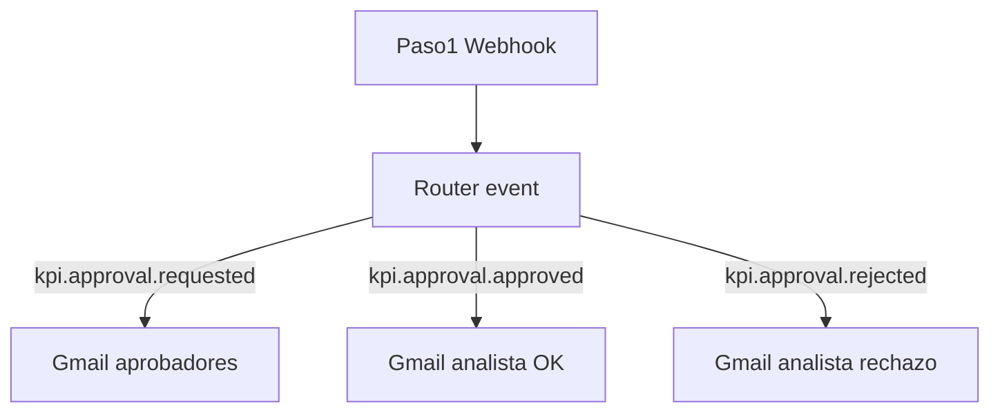

# Guía Activepieces — Aprobaciones KPI (RF-05/06)

Automatización de correos para el flujo de aprobaciones cuando un **analista** envía solicitudes de creación, edición o medición de KPI.

| Rama en Activepieces | Evento | Cuándo se dispara | Destinatario |
|----------------------|--------|-------------------|--------------|
| **Solicitud pendiente** | `kpi.approval.requested` | Analista envía solicitud (`estado: pendiente`) | Admin, directores y gerente del hotel |
| **Solicitud aprobada** | `kpi.approval.approved` | Aprobador aprueba la solicitud | Analista solicitante |
| **Solicitud rechazada** | `kpi.approval.rejected` | Aprobador rechaza con observaciones | Analista solicitante |

La app enviará **POST JSON** al webhook configurado en `ACTIVEPIECES_WEBHOOK_URL`. El Router lee `body.event` y enruta a la rama correcta.

> **Nota:** los payloads de esta guía son el contrato previsto para la integración en `kpi-actions.ts`. Mientras tanto, puede probar cada rama con los comandos PowerShell de abajo.

---

## Paso 1 — Capturar Webhook (común a los tres)

Piensa en el paso 1 como un **buzón con dirección**:

- La **URL** es la dirección del buzón.
- Cuando la app (o tú desde consola) envía un JSON, Activepieces lo guarda en `body`.
- Los campos **no aparecen** en el editor hasta que envías datos a esa URL.

| Tipo | Ejemplo |
|------|---------|
| URL viva | `https://cloud.activepieces.com/api/v1/webhooks/H9xxxxx` |
| URL test | `https://cloud.activepieces.com/api/v1/webhooks/H9xxxxx/test` |

Usa `/test` para practicar en el editor.

### Cómo cargar datos de prueba

1. **Publicar** el flow (o usar URL `/test`).
2. Ejecutar el PowerShell del evento que quieras probar (ver cada sección abajo).
3. Ver el `body` en el paso 1 o en **Runs** → última ejecución.

### Router — condiciones exactas

Añade tres ramas al Router principal (junto a alertas, import, etc.):

| Rama | Condición |
|------|-----------|
| Solicitud pendiente | `body.event` igual a `kpi.approval.requested` |
| Solicitud aprobada | `body.event` igual a `kpi.approval.approved` |
| Solicitud rechazada | `body.event` igual a `kpi.approval.rejected` |



### Mapeo `tipo` → `tipoLabel`

| `tipo` | `tipoLabel` |
|--------|-------------|
| `medicion` | Registro de medición |
| `creacion` | Creación de KPI |
| `edicion` | Edición de KPI |

---

# 1. Solicitud pendiente (`kpi.approval.requested`)

## Cuándo se dispara

Cuando un usuario con rol **analista** envía:

- un **registro de medición** (`tipo: medicion`),
- una **creación de KPI** (`tipo: creacion`), o
- una **edición de KPI** (`tipo: edicion`).

Los roles administrador, director_comercial, director_mercadeo y gerente_hotel **no** generan este evento (escritura directa).

## Payload

| Campo | Ejemplo | Uso en el correo |
|-------|---------|------------------|
| `event` | `kpi.approval.requested` | Rama del Router |
| `timestamp` | ISO 8601 | Fecha de envío |
| `requestId` | UUID | Trazabilidad |
| `tipo` | `medicion` | Tipo técnico |
| `tipoLabel` | Registro de medición | Texto legible |
| `hotelId` | UUID | Contexto |
| `hotelNombre` | Hotel Estelar Medellín | Cuerpo |
| `kpiId` | UUID | Contexto |
| `kpiCodigo` | REV-001 | Asunto y cuerpo |
| `kpiNombre` | Revenue por habitación | Cuerpo |
| `solicitanteNombre` | Ana Pérez | Cuerpo |
| `solicitanteEmail` | ana@empresa.com | Cuerpo |
| `approverEmails` | `["admin@...", "dir@..."]` | Destinatarios globales |
| `gerenteEmails` | `["gerente@..."]` | Gerente del hotel |
| `notifyEmails` | array unificado (opcional) | Alternativa: un solo campo **Para** |
| `resumen` | Medición propuesta: valor 85.5… | Detalle de la solicitud |
| `approvalUrl` | `https://tu-app/admin/aprobaciones` | Botón CTA |

### JSON de prueba (PowerShell)

```powershell
$url = "https://cloud.activepieces.com/api/v1/webhooks/TU_ID_AQUI/test"
$body = @'
{
  "event": "kpi.approval.requested",
  "timestamp": "2026-06-25T10:00:00.000Z",
  "requestId": "req-001",
  "tipo": "medicion",
  "tipoLabel": "Registro de medición",
  "hotelId": "hotel-001",
  "hotelNombre": "Hotel Estelar Medellín",
  "kpiId": "kpi-001",
  "kpiCodigo": "REV-001",
  "kpiNombre": "Revenue por habitación",
  "solicitanteNombre": "Ana Pérez",
  "solicitanteEmail": "ana@empresa.com",
  "approverEmails": ["admin@empresa.com", "director.comercial@empresa.com", "director.mercadeo@empresa.com"],
  "gerenteEmails": ["gerente.hotel@empresa.com"],
  "notifyEmails": ["admin@empresa.com", "director.comercial@empresa.com", "director.mercadeo@empresa.com", "gerente.hotel@empresa.com"],
  "resumen": "Medición propuesta: valor 85.5, fecha 2026-06-20",
  "approvalUrl": "https://tu-app.vercel.app/admin/aprobaciones"
}
'@
Invoke-RestMethod -Uri $url -Method POST -ContentType "application/json" -Body $body
```

## Paso Gmail — texto plano

| Campo | Qué poner |
|-------|-----------|
| **Para** | `body` → `notifyEmails` (o combinar `approverEmails` + `gerenteEmails`) |
| **Asunto** | `[Aprobación pendiente] ` + `tipoLabel` + ` — ` + `kpiCodigo` + ` · ` + `hotelNombre` |
| **Cuerpo** | `solicitanteNombre` + ` envió una solicitud de ` + `tipoLabel` + `. Resumen: ` + `resumen` |

## Paso Gmail — plantilla HTML

Tipo de cuerpo: **HTML**. Sustituye cada `{{step_1.body.xxx}}` arrastrando el campo desde `1. Capturar Webhook` → `body` (no pegues el objeto JSON del chip).

```html
<!DOCTYPE html>
<html lang="es">
<head>
  <meta charset="UTF-8">
  <meta name="viewport" content="width=device-width, initial-scale=1.0">
</head>
<body style="margin: 0; padding: 0; background-color: #f1f5f9; font-family: Arial, Helvetica, sans-serif;">
  <table role="presentation" width="100%" cellspacing="0" cellpadding="0" style="background-color: #f1f5f9; padding: 32px 16px;">
    <tr>
      <td align="center">
        <table role="presentation" width="600" cellspacing="0" cellpadding="0" style="max-width: 600px; background-color: #ffffff; border-radius: 8px; overflow: hidden; box-shadow: 0 2px 8px rgba(0,0,0,0.06);">
          <tr>
            <td style="background-color: #1e293b; padding: 24px 32px;">
              <p style="margin: 0; color: #94a3b8; font-size: 12px; letter-spacing: 1px; text-transform: uppercase;">Sistema KPIs Estelar</p>
              <h1 style="margin: 8px 0 0; color: #ffffff; font-size: 20px; font-weight: bold;">Solicitud de aprobación</h1>
            </td>
          </tr>
          <tr>
            <td style="padding: 32px;">
              <table role="presentation" width="100%" cellspacing="0" cellpadding="0" style="background-color: #eff6ff; border-left: 4px solid #2563eb; margin-bottom: 24px;">
                <tr>
                  <td style="padding: 16px 20px; color: #1e40af; font-size: 14px; line-height: 1.6; font-weight: bold;">
                    Hay una solicitud pendiente de su revisión
                  </td>
                </tr>
              </table>
              <p style="margin: 0 0 20px; color: #334155; font-size: 15px; line-height: 1.6;">
                <strong>{{step_1.body.solicitanteNombre}}</strong> ({{step_1.body.solicitanteEmail}}) ha enviado una solicitud de
                <strong>{{step_1.body.tipoLabel}}</strong> que requiere aprobación antes de aplicarse al sistema.
              </p>
              <table role="presentation" width="100%" cellspacing="0" cellpadding="0" style="border: 1px solid #e2e8f0; border-radius: 6px; margin-bottom: 24px;">
                <tr style="background-color: #f8fafc;">
                  <td style="padding: 12px 16px; color: #64748b; font-size: 13px; width: 140px; font-weight: bold;">Tipo</td>
                  <td style="padding: 12px 16px; color: #1e293b; font-size: 14px; font-weight: bold;">{{step_1.body.tipoLabel}}</td>
                </tr>
                <tr>
                  <td style="padding: 12px 16px; color: #64748b; font-size: 13px; font-weight: bold;">KPI</td>
                  <td style="padding: 12px 16px; color: #1e293b; font-size: 14px;">{{step_1.body.kpiCodigo}} — {{step_1.body.kpiNombre}}</td>
                </tr>
                <tr style="background-color: #f8fafc;">
                  <td style="padding: 12px 16px; color: #64748b; font-size: 13px; font-weight: bold;">Hotel</td>
                  <td style="padding: 12px 16px; color: #1e293b; font-size: 14px;">{{step_1.body.hotelNombre}}</td>
                </tr>
                <tr>
                  <td style="padding: 12px 16px; color: #64748b; font-size: 13px; font-weight: bold;">Resumen</td>
                  <td style="padding: 12px 16px; color: #334155; font-size: 14px; line-height: 1.6;">{{step_1.body.resumen}}</td>
                </tr>
                <tr style="background-color: #f8fafc;">
                  <td style="padding: 12px 16px; color: #64748b; font-size: 13px; font-weight: bold;">Solicitud</td>
                  <td style="padding: 12px 16px; color: #1e293b; font-size: 12px; font-family: monospace;">{{step_1.body.requestId}}</td>
                </tr>
                <tr>
                  <td style="padding: 12px 16px; color: #64748b; font-size: 13px; font-weight: bold;">Fecha</td>
                  <td style="padding: 12px 16px; color: #1e293b; font-size: 14px;">{{step_1.body.timestamp}}</td>
                </tr>
              </table>
              <table role="presentation" cellspacing="0" cellpadding="0">
                <tr>
                  <td style="border-radius: 6px; background-color: #1e293b;">
                    <a href="{{step_1.body.approvalUrl}}"
                       target="_blank"
                       style="display: inline-block; padding: 14px 28px; color: #ffffff; font-size: 14px; font-weight: bold; text-decoration: none;">
                      Ir a bandeja de aprobaciones →
                    </a>
                  </td>
                </tr>
              </table>
              <p style="margin: 24px 0 0; color: #94a3b8; font-size: 12px; line-height: 1.5;">
                Hasta que apruebe o rechace esta solicitud, el cambio <strong>no</strong> se reflejará en el dashboard ni en el histórico.
              </p>
            </td>
          </tr>
          <tr>
            <td style="background-color: #f8fafc; padding: 16px 32px; border-top: 1px solid #e2e8f0;">
              <p style="margin: 0; color: #94a3b8; font-size: 11px; text-align: center;">
                Hoteles Estelar — Sistema de KPIs · Notificación automática
              </p>
            </td>
          </tr>
        </table>
      </td>
    </tr>
  </table>
</body>
</html>
```

---

# 2. Solicitud aprobada (`kpi.approval.approved`)

## Cuándo se dispara

Cuando un **administrador**, **director_comercial**, **director_mercadeo** o **gerente_hotel** (de ese hotel) aprueba una solicitud pendiente.

## Payload

| Campo | Ejemplo | Uso en el correo |
|-------|---------|------------------|
| `event` | `kpi.approval.approved` | Rama del Router |
| `timestamp` | ISO 8601 | Fecha |
| `requestId` | UUID | Trazabilidad |
| `tipo` | `medicion` | Contexto |
| `tipoLabel` | Registro de medición | Asunto y cuerpo |
| `kpiCodigo` | REV-001 | Asunto y cuerpo |
| `kpiNombre` | Revenue por habitación | Cuerpo |
| `solicitanteNombre` | Ana Pérez | Saludo |
| `solicitanteEmail` | ana@empresa.com | **Para** |
| `aprobadorNombre` | Carlos Gerente | Cuerpo |
| `mensaje` | Su medición fue aprobada… | Párrafo principal |
| `kpiUrl` | `https://tu-app/kpis/uuid?tab=seguimiento` | Botón CTA |

### JSON de prueba (PowerShell)

```powershell
$url = "https://cloud.activepieces.com/api/v1/webhooks/TU_ID_AQUI/test"
$body = @'
{
  "event": "kpi.approval.approved",
  "timestamp": "2026-06-25T10:00:00.000Z",
  "requestId": "req-001",
  "tipo": "medicion",
  "tipoLabel": "Registro de medición",
  "kpiCodigo": "REV-001",
  "kpiNombre": "Revenue por habitación",
  "solicitanteNombre": "Ana Pérez",
  "solicitanteEmail": "ana@empresa.com",
  "aprobadorNombre": "Carlos Gerente",
  "mensaje": "Su medición fue aprobada. El valor ya alimenta el dashboard y el histórico.",
  "kpiUrl": "https://tu-app.vercel.app/kpis/kpi-001?tab=seguimiento"
}
'@
Invoke-RestMethod -Uri $url -Method POST -ContentType "application/json" -Body $body
```

## Paso Gmail — texto plano

| Campo | Qué poner |
|-------|-----------|
| **Para** | `body` → `solicitanteEmail` |
| **Asunto** | `✓ Aprobada: ` + `tipoLabel` + ` — ` + `kpiCodigo` |
| **Cuerpo** | `mensaje` + salto + `Aprobado por: ` + `aprobadorNombre` |

## Paso Gmail — plantilla HTML

```html
<!DOCTYPE html>
<html lang="es">
<head>
  <meta charset="UTF-8">
  <meta name="viewport" content="width=device-width, initial-scale=1.0">
</head>
<body style="margin: 0; padding: 0; background-color: #f1f5f9; font-family: Arial, Helvetica, sans-serif;">
  <table role="presentation" width="100%" cellspacing="0" cellpadding="0" style="background-color: #f1f5f9; padding: 32px 16px;">
    <tr>
      <td align="center">
        <table role="presentation" width="600" cellspacing="0" cellpadding="0" style="max-width: 600px; background-color: #ffffff; border-radius: 8px; overflow: hidden; box-shadow: 0 2px 8px rgba(0,0,0,0.06);">
          <tr>
            <td style="background-color: #065f46; padding: 24px 32px;">
              <p style="margin: 0; color: #a7f3d0; font-size: 12px; letter-spacing: 1px; text-transform: uppercase;">Sistema KPIs Estelar</p>
              <h1 style="margin: 8px 0 0; color: #ffffff; font-size: 20px; font-weight: bold;">Solicitud aprobada</h1>
            </td>
          </tr>
          <tr>
            <td style="padding: 32px;">
              <table role="presentation" width="100%" cellspacing="0" cellpadding="0" style="background-color: #ecfdf5; border-left: 4px solid #059669; margin-bottom: 24px;">
                <tr>
                  <td style="padding: 16px 20px; color: #065f46; font-size: 14px; line-height: 1.6; font-weight: bold;">
                    Su solicitud fue aprobada y ya está aplicada en el sistema
                  </td>
                </tr>
              </table>
              <p style="margin: 0 0 20px; color: #334155; font-size: 15px; line-height: 1.6;">
                Hola <strong>{{step_1.body.solicitanteNombre}}</strong>,
              </p>
              <p style="margin: 0 0 20px; color: #334155; font-size: 15px; line-height: 1.6;">
                {{step_1.body.mensaje}}
              </p>
              <table role="presentation" width="100%" cellspacing="0" cellpadding="0" style="border: 1px solid #e2e8f0; border-radius: 6px; margin-bottom: 24px;">
                <tr style="background-color: #f8fafc;">
                  <td style="padding: 12px 16px; color: #64748b; font-size: 13px; width: 140px; font-weight: bold;">Tipo</td>
                  <td style="padding: 12px 16px; color: #1e293b; font-size: 14px;">{{step_1.body.tipoLabel}}</td>
                </tr>
                <tr>
                  <td style="padding: 12px 16px; color: #64748b; font-size: 13px; font-weight: bold;">KPI</td>
                  <td style="padding: 12px 16px; color: #1e293b; font-size: 14px;">{{step_1.body.kpiCodigo}} — {{step_1.body.kpiNombre}}</td>
                </tr>
                <tr style="background-color: #f8fafc;">
                  <td style="padding: 12px 16px; color: #64748b; font-size: 13px; font-weight: bold;">Aprobado por</td>
                  <td style="padding: 12px 16px; color: #1e293b; font-size: 14px;">{{step_1.body.aprobadorNombre}}</td>
                </tr>
                <tr>
                  <td style="padding: 12px 16px; color: #64748b; font-size: 13px; font-weight: bold;">Solicitud</td>
                  <td style="padding: 12px 16px; color: #1e293b; font-size: 12px; font-family: monospace;">{{step_1.body.requestId}}</td>
                </tr>
                <tr style="background-color: #f8fafc;">
                  <td style="padding: 12px 16px; color: #64748b; font-size: 13px; font-weight: bold;">Fecha</td>
                  <td style="padding: 12px 16px; color: #1e293b; font-size: 14px;">{{step_1.body.timestamp}}</td>
                </tr>
              </table>
              <table role="presentation" cellspacing="0" cellpadding="0">
                <tr>
                  <td style="border-radius: 6px; background-color: #059669;">
                    <a href="{{step_1.body.kpiUrl}}"
                       target="_blank"
                       style="display: inline-block; padding: 14px 28px; color: #ffffff; font-size: 14px; font-weight: bold; text-decoration: none;">
                      Ver KPI en el sistema →
                    </a>
                  </td>
                </tr>
              </table>
            </td>
          </tr>
          <tr>
            <td style="background-color: #f8fafc; padding: 16px 32px; border-top: 1px solid #e2e8f0;">
              <p style="margin: 0; color: #94a3b8; font-size: 11px; text-align: center;">
                Hoteles Estelar — Sistema de KPIs · Notificación automática
              </p>
            </td>
          </tr>
        </table>
      </td>
    </tr>
  </table>
</body>
</html>
```

---

# 3. Solicitud rechazada (`kpi.approval.rejected`)

## Cuándo se dispara

Cuando un aprobador **rechaza** la solicitud e incluye observaciones obligatorias.

## Payload

| Campo | Ejemplo | Uso en el correo |
|-------|---------|------------------|
| `event` | `kpi.approval.rejected` | Rama del Router |
| `timestamp` | ISO 8601 | Fecha |
| `requestId` | UUID | Trazabilidad |
| `tipo` | `medicion` | Contexto |
| `tipoLabel` | Registro de medición | Asunto y cuerpo |
| `kpiCodigo` | REV-001 | Asunto y cuerpo |
| `kpiNombre` | Revenue por habitación | Cuerpo |
| `solicitanteNombre` | Ana Pérez | Saludo |
| `solicitanteEmail` | ana@empresa.com | **Para** |
| `aprobadorNombre` | Carlos Gerente | Cuerpo |
| `observaciones` | El valor no coincide… | Bloque destacado |
| `resumen` | Medición propuesta: valor 85.5… | Qué envió el analista |
| `approvalUrl` | `https://tu-app/admin/aprobaciones` | Botón CTA |

### JSON de prueba (PowerShell)

```powershell
$url = "https://cloud.activepieces.com/api/v1/webhooks/TU_ID_AQUI/test"
$body = @'
{
  "event": "kpi.approval.rejected",
  "timestamp": "2026-06-25T10:00:00.000Z",
  "requestId": "req-001",
  "tipo": "medicion",
  "tipoLabel": "Registro de medición",
  "kpiCodigo": "REV-001",
  "kpiNombre": "Revenue por habitación",
  "solicitanteNombre": "Ana Pérez",
  "solicitanteEmail": "ana@empresa.com",
  "aprobadorNombre": "Carlos Gerente",
  "observaciones": "El valor no coincide con el reporte PMS.",
  "resumen": "Medición propuesta: valor 85.5, fecha 2026-06-20",
  "approvalUrl": "https://tu-app.vercel.app/admin/aprobaciones"
}
'@
Invoke-RestMethod -Uri $url -Method POST -ContentType "application/json" -Body $body
```

## Paso Gmail — texto plano

| Campo | Qué poner |
|-------|-----------|
| **Para** | `body` → `solicitanteEmail` |
| **Asunto** | `✗ Rechazada: ` + `tipoLabel` + ` — ` + `kpiCodigo` |
| **Cuerpo** | `Su solicitud fue rechazada.` + salto + `Observaciones: ` + `observaciones` |

## Paso Gmail — plantilla HTML

```html
<!DOCTYPE html>
<html lang="es">
<head>
  <meta charset="UTF-8">
  <meta name="viewport" content="width=device-width, initial-scale=1.0">
</head>
<body style="margin: 0; padding: 0; background-color: #f1f5f9; font-family: Arial, Helvetica, sans-serif;">
  <table role="presentation" width="100%" cellspacing="0" cellpadding="0" style="background-color: #f1f5f9; padding: 32px 16px;">
    <tr>
      <td align="center">
        <table role="presentation" width="600" cellspacing="0" cellpadding="0" style="max-width: 600px; background-color: #ffffff; border-radius: 8px; overflow: hidden; box-shadow: 0 2px 8px rgba(0,0,0,0.06);">
          <tr>
            <td style="background-color: #92400e; padding: 24px 32px;">
              <p style="margin: 0; color: #fde68a; font-size: 12px; letter-spacing: 1px; text-transform: uppercase;">Sistema KPIs Estelar</p>
              <h1 style="margin: 8px 0 0; color: #ffffff; font-size: 20px; font-weight: bold;">Solicitud rechazada</h1>
            </td>
          </tr>
          <tr>
            <td style="padding: 32px;">
              <p style="margin: 0 0 20px; color: #334155; font-size: 15px; line-height: 1.6;">
                Hola <strong>{{step_1.body.solicitanteNombre}}</strong>,
              </p>
              <p style="margin: 0 0 20px; color: #334155; font-size: 15px; line-height: 1.6;">
                Su solicitud de <strong>{{step_1.body.tipoLabel}}</strong> para el KPI
                <strong>{{step_1.body.kpiCodigo}} — {{step_1.body.kpiNombre}}</strong>
                fue revisada por <strong>{{step_1.body.aprobadorNombre}}</strong> y fue rechazada.
              </p>
              <table role="presentation" width="100%" cellspacing="0" cellpadding="0" style="background-color: #fef2f2; border: 1px solid #fecaca; border-radius: 6px; margin-bottom: 24px;">
                <tr>
                  <td style="padding: 16px 20px;">
                    <p style="margin: 0 0 8px; color: #991b1b; font-size: 12px; font-weight: bold; text-transform: uppercase;">Observaciones del aprobador</p>
                    <p style="margin: 0; color: #7f1d1d; font-size: 14px; line-height: 1.6;">{{step_1.body.observaciones}}</p>
                  </td>
                </tr>
              </table>
              <table role="presentation" width="100%" cellspacing="0" cellpadding="0" style="border: 1px solid #e2e8f0; border-radius: 6px; margin-bottom: 24px;">
                <tr style="background-color: #f8fafc;">
                  <td style="padding: 12px 16px; color: #64748b; font-size: 13px; width: 140px; font-weight: bold;">Tipo</td>
                  <td style="padding: 12px 16px; color: #1e293b; font-size: 14px;">{{step_1.body.tipoLabel}}</td>
                </tr>
                <tr>
                  <td style="padding: 12px 16px; color: #64748b; font-size: 13px; font-weight: bold;">Resumen enviado</td>
                  <td style="padding: 12px 16px; color: #334155; font-size: 14px; line-height: 1.6;">{{step_1.body.resumen}}</td>
                </tr>
                <tr style="background-color: #f8fafc;">
                  <td style="padding: 12px 16px; color: #64748b; font-size: 13px; font-weight: bold;">Solicitud</td>
                  <td style="padding: 12px 16px; color: #1e293b; font-size: 12px; font-family: monospace;">{{step_1.body.requestId}}</td>
                </tr>
                <tr>
                  <td style="padding: 12px 16px; color: #64748b; font-size: 13px; font-weight: bold;">Fecha</td>
                  <td style="padding: 12px 16px; color: #1e293b; font-size: 14px;">{{step_1.body.timestamp}}</td>
                </tr>
              </table>
              <p style="margin: 0 0 20px; color: #64748b; font-size: 14px; line-height: 1.6;">
                Puede corregir la información y enviar una nueva solicitud desde el sistema.
              </p>
              <table role="presentation" cellspacing="0" cellpadding="0">
                <tr>
                  <td style="border-radius: 6px; background-color: #1e293b;">
                    <a href="{{step_1.body.approvalUrl}}"
                       target="_blank"
                       style="display: inline-block; padding: 14px 28px; color: #ffffff; font-size: 14px; font-weight: bold; text-decoration: none;">
                      Ver mis solicitudes →
                    </a>
                  </td>
                </tr>
              </table>
            </td>
          </tr>
          <tr>
            <td style="background-color: #f8fafc; padding: 16px 32px; border-top: 1px solid #e2e8f0;">
              <p style="margin: 0; color: #94a3b8; font-size: 11px; text-align: center;">
                Hoteles Estelar — Sistema de KPIs · Notificación automática
              </p>
            </td>
          </tr>
        </table>
      </td>
    </tr>
  </table>
</body>
</html>
```

---

## Errores muy comunes

| Problema | Solución |
|----------|----------|
| Paso 1 solo muestra la URL | Envía POST a URL `/test` con el JSON **completo** de la rama antes de mapear campos. |
| Campos vacíos en Gmail | Estás probando con JSON de otro evento (`requested` vs `approved` vs `rejected`). |
| Aparece JSON gigante en el HTML | Al arrastrar campos se pegó el objeto del chip entero. Borra y deja solo la expresión (pill) o `{{step_1.body.campo}}`. |
| Mezcla `step_1.body` y `trigger['output']['body']` | Usa **una sola** sintaxis en todo el template; arrastra siempre desde el mismo paso. |
| Plantilla de aprobada con payload de pendiente | Cada rama tiene campos distintos: `mensaje`/`kpiUrl` solo en `approved`; `observaciones` solo en `rejected`. |
| Array de correos no funciona en **Para** | Prueba primero con un correo fijo; si falla, usa `notifyEmails` o un paso Code que una los arrays. |

---

## Prueba end-to-end

1. **Solicitud pendiente** → ejecuta PowerShell §1; verifica Gmail a `notifyEmails`.
2. **Aprobada** → ejecuta PowerShell §2; verifica Gmail a `solicitanteEmail`.
3. **Rechazada** → ejecuta PowerShell §3; verifica que `observaciones` y `resumen` se rendericen.
4. En Activepieces: revisa **Runs** tras cada POST.

---

## Ver también

- [activepieces-workflows.md](./activepieces-workflows.md) — Router global, `.env.local` y resto de eventos.
- [activepieces-alertas.md](./activepieces-alertas.md) — Patrón Webhook → Router → Gmail HTML.
