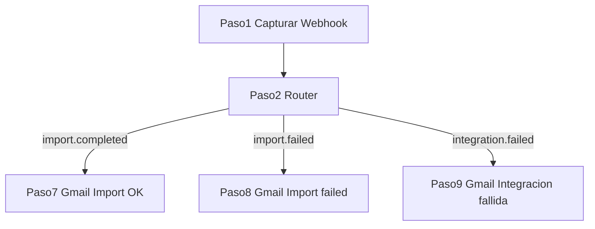

# Guía Activepieces — Importación e integración

Automatización de correos para tres ramas del Router (**HU-KPI-004** y **HU-KPI-005**):

| Rama en Activepieces | Evento | Cuándo se dispara |
|----------------------|--------|-------------------|
| **Import OK** | `import.completed` | La importación termina con éxito total o parcial |
| **Import failed** | `import.failed` | La importación falla por completo o lanza error |
| **Integracion fallida** | `integration.failed` | Un job de integración agota todos los reintentos |

La app envía **POST JSON** al webhook configurado en `ACTIVEPIECES_WEBHOOK_URL`. El Router lee `body.event` y enruta a la rama correcta.

**Nota sobre destinatarios:** ninguno de estos tres eventos incluye `emails` en el payload. En Gmail debes poner un correo fijo (ej. operaciones o administrador).

---

## Paso 1 — Capturar Webhook (común a los tres)

Piensa en el paso 1 como un **buzón con dirección**:

- La **URL** es la dirección del buzón.
- Cuando la app (o tú desde consola) envía un JSON, Activepieces lo guarda en `body`.
- Los campos **no aparecen** en el editor hasta que envías datos a esa URL.

| Tipo | Ejemplo |
|------|---------|
| URL viva | `https://cloud.activepieces.com/api/v1/webhooks/H9xxxxx` |
| URL test | `https://cloud.activepieces.com/api/v1/webhooks/H9xxxxx/test` |

Usa `/test` para practicar en el editor.

### Cómo cargar datos de prueba

1. **Publicar** el flow (o usar URL `/test`).
2. Ejecutar el PowerShell del evento que quieras probar (ver cada sección abajo).
3. Ver el `body` en el paso 1 o en **Runs** → última ejecución.

### Router — condiciones exactas

| Rama | Condición |
|------|-----------|
| Import OK | `body.event` igual a `import.completed` |
| Import failed | `body.event` igual a `import.failed` |
| Integracion fallida | `body.event` igual a `integration.failed` |

---

# 1. Import OK (`import.completed`)

## Cuándo se dispara

Al terminar de procesar un archivo Excel/CSV en `/import`:

- **`completado`** — todas las filas OK (`filasError` = 0)
- **`parcial`** — algunas filas OK y algunas con error (`filasError` > 0)

Si **todas** las filas fallan, la app envía `import.failed` (ver sección 2), no `import.completed`.

## Payload

| Campo | Ejemplo | Uso en el correo |
|-------|---------|------------------|
| `event` | `import.completed` | Rama del Router |
| `timestamp` | ISO 8601 | Pie del correo |
| `jobId` | UUID | Trazabilidad / enlace |
| `estado` | `completado` / `parcial` | Badge de estado |
| `totalFilas` | `100` | Total procesadas |
| `filasOk` | `95` | Filas correctas |
| `filasError` | `5` | Filas con error |
| `nombreArchivo` | `kpis_junio.xlsx` | Nombre del archivo |

### JSON de prueba (PowerShell)

```powershell
$url = "https://cloud.activepieces.com/api/v1/webhooks/TU_ID_AQUI/test"
$body = @'
{
  "event": "import.completed",
  "timestamp": "2026-06-24T10:00:00.000Z",
  "jobId": "job-import-001",
  "estado": "parcial",
  "totalFilas": 100,
  "filasOk": 95,
  "filasError": 5,
  "nombreArchivo": "kpis_junio.xlsx"
}
'@
Invoke-RestMethod -Uri $url -Method POST -ContentType "application/json" -Body $body
```

Para probar importación **100 % exitosa**, cambia `"estado": "completado"` y `"filasError": 0`, `"filasOk": 100`.

## Paso Gmail — texto plano

| Campo | Qué poner |
|-------|-----------|
| **Para** | Correo fijo (ej. `operaciones@estelar.com`) |
| **Asunto** | `Importación finalizada — ` + `body` → `nombreArchivo` |
| **Cuerpo** | `Archivo: ` + `nombreArchivo` + salto + `Estado: ` + `estado` + salto + `OK: ` + `filasOk` + ` / Error: ` + `filasError` + ` / Total: ` + `totalFilas` |

## Paso Gmail — plantilla HTML

Tipo de cuerpo: **HTML**. Sustituye cada `{{...}}` desde el panel (`1. Capturar Webhook` → `body` → campo).

Encabezado **verde** si `estado` = `completado`; si es `parcial`, puedes dejar el mismo diseño y el texto de estado ya indica que hubo errores.

```html
<!DOCTYPE html>
<html lang="es">
<head>
  <meta charset="UTF-8">
  <meta name="viewport" content="width=device-width, initial-scale=1.0">
</head>
<body style="margin: 0; padding: 0; background-color: #f1f5f9; font-family: Arial, Helvetica, sans-serif;">
  <table role="presentation" width="100%" cellspacing="0" cellpadding="0" style="background-color: #f1f5f9; padding: 32px 16px;">
    <tr>
      <td align="center">
        <table role="presentation" width="600" cellspacing="0" cellpadding="0" style="max-width: 600px; background-color: #ffffff; border-radius: 8px; overflow: hidden; box-shadow: 0 2px 8px rgba(0,0,0,0.06);">
          <tr>
            <td style="background-color: #166534; padding: 24px 32px;">
              <p style="margin: 0; color: #bbf7d0; font-size: 12px; letter-spacing: 1px; text-transform: uppercase;">Sistema KPIs Estelar</p>
              <h1 style="margin: 8px 0 0; color: #ffffff; font-size: 20px; font-weight: bold;">Importación finalizada</h1>
            </td>
          </tr>
          <tr>
            <td style="padding: 32px;">
              <p style="margin: 0 0 20px; color: #334155; font-size: 15px; line-height: 1.6;">
                El archivo se procesó correctamente. Revise el detalle a continuación.
              </p>
              <table role="presentation" width="100%" cellspacing="0" cellpadding="0" style="border: 1px solid #e2e8f0; border-radius: 6px; margin-bottom: 28px;">
                <tr style="background-color: #f8fafc;">
                  <td style="padding: 12px 16px; color: #64748b; font-size: 13px; width: 140px; border-bottom: 1px solid #e2e8f0; font-weight: bold;">Archivo</td>
                  <td style="padding: 12px 16px; color: #1e293b; font-size: 14px; border-bottom: 1px solid #e2e8f0;">{{step_1.body.nombreArchivo}}</td>
                </tr>
                <tr>
                  <td style="padding: 12px 16px; color: #64748b; font-size: 13px; font-weight: bold;">Estado</td>
                  <td style="padding: 12px 16px; color: #1e293b; font-size: 14px; text-transform: capitalize;">{{step_1.body.estado}}</td>
                </tr>
                <tr style="background-color: #f8fafc;">
                  <td style="padding: 12px 16px; color: #64748b; font-size: 13px; font-weight: bold;">Filas OK</td>
                  <td style="padding: 12px 16px; color: #166534; font-size: 14px; font-weight: bold;">{{step_1.body.filasOk}}</td>
                </tr>
                <tr>
                  <td style="padding: 12px 16px; color: #64748b; font-size: 13px; font-weight: bold;">Filas con error</td>
                  <td style="padding: 12px 16px; color: #b45309; font-size: 14px; font-weight: bold;">{{step_1.body.filasError}}</td>
                </tr>
                <tr style="background-color: #f8fafc;">
                  <td style="padding: 12px 16px; color: #64748b; font-size: 13px; font-weight: bold;">Total filas</td>
                  <td style="padding: 12px 16px; color: #1e293b; font-size: 14px;">{{step_1.body.totalFilas}}</td>
                </tr>
              </table>
              <table role="presentation" cellspacing="0" cellpadding="0">
                <tr>
                  <td style="border-radius: 6px; background-color: #166534;">
                    <a href="https://tu-app.vercel.app/import"
                       target="_blank"
                       style="display: inline-block; padding: 14px 28px; color: #ffffff; font-size: 14px; font-weight: bold; text-decoration: none;">
                      Ver historial de importación →
                    </a>
                  </td>
                </tr>
              </table>
              <p style="margin: 24px 0 0; color: #94a3b8; font-size: 12px; line-height: 1.5;">
                Job: {{step_1.body.jobId}}
              </p>
            </td>
          </tr>
          <tr>
            <td style="background-color: #f8fafc; padding: 16px 32px; border-top: 1px solid #e2e8f0;">
              <p style="margin: 0; color: #94a3b8; font-size: 11px; text-align: center;">
                Notificación automática · {{step_1.body.timestamp}}<br>
                No responda a este correo.
              </p>
            </td>
          </tr>
        </table>
      </td>
    </tr>
  </table>
</body>
</html>
```

### Opcional — rama extra si hay errores parciales

Si `filasError` > 0, puedes añadir después del Gmail un **Branch (IF)**:

- Condición: `body.filasError` mayor que `0`
- Acción: segundo correo a un canal de operaciones con asunto `Importación con errores — {{nombreArchivo}}`

---

# 2. Import failed (`import.failed`)

## Cuándo se dispara

Dos casos en la app:

1. **Todas las filas fallaron** al procesar el archivo (`estado` = `fallido`, pero el payload incluye estadísticas).
2. **Error crítico** durante el procesamiento (excepción): solo `jobId` y `error`.

## Payload — variante A (filas fallidas)

| Campo | Ejemplo |
|-------|---------|
| `jobId` | UUID |
| `estado` | `fallido` |
| `totalFilas` | `50` |
| `filasOk` | `0` |
| `filasError` | `50` |
| `nombreArchivo` | `kpis_junio.xlsx` |

## Payload — variante B (error crítico)

| Campo | Ejemplo |
|-------|---------|
| `jobId` | UUID |
| `error` | `No se pudo leer el archivo: formato inválido` |

### JSON de prueba — variante A (PowerShell)

```powershell
$url = "https://cloud.activepieces.com/api/v1/webhooks/TU_ID_AQUI/test"
$body = @'
{
  "event": "import.failed",
  "timestamp": "2026-06-24T10:00:00.000Z",
  "jobId": "job-import-002",
  "estado": "fallido",
  "totalFilas": 50,
  "filasOk": 0,
  "filasError": 50,
  "nombreArchivo": "kpis_junio.xlsx"
}
'@
Invoke-RestMethod -Uri $url -Method POST -ContentType "application/json" -Body $body
```

### JSON de prueba — variante B (error crítico)

```powershell
$url = "https://cloud.activepieces.com/api/v1/webhooks/TU_ID_AQUI/test"
$body = @'
{
  "event": "import.failed",
  "timestamp": "2026-06-24T10:00:00.000Z",
  "jobId": "job-import-003",
  "error": "No se pudo leer el archivo: formato inválido"
}
'@
Invoke-RestMethod -Uri $url -Method POST -ContentType "application/json" -Body $body
```

## Paso Gmail — texto plano

| Campo | Qué poner |
|-------|-----------|
| **Para** | Correo fijo (ej. `operaciones@estelar.com`) |
| **Asunto** | `Importación fallida — job ` + `body` → `jobId` |
| **Cuerpo** | Si existe `body.error`, úsalo. Si no, escribe: `Archivo: nombreArchivo` + ` — 0 de totalFilas filas procesadas.` |

## Paso Gmail — plantilla HTML

Encabezado **rojo** (`#991b1b`). Incluye bloque de error visible; si solo hay estadísticas (variante A), la tabla muestra 0 OK.

```html
<!DOCTYPE html>
<html lang="es">
<head>
  <meta charset="UTF-8">
  <meta name="viewport" content="width=device-width, initial-scale=1.0">
</head>
<body style="margin: 0; padding: 0; background-color: #f1f5f9; font-family: Arial, Helvetica, sans-serif;">
  <table role="presentation" width="100%" cellspacing="0" cellpadding="0" style="background-color: #f1f5f9; padding: 32px 16px;">
    <tr>
      <td align="center">
        <table role="presentation" width="600" cellspacing="0" cellpadding="0" style="max-width: 600px; background-color: #ffffff; border-radius: 8px; overflow: hidden; box-shadow: 0 2px 8px rgba(0,0,0,0.06);">
          <tr>
            <td style="background-color: #991b1b; padding: 24px 32px;">
              <p style="margin: 0; color: #fecaca; font-size: 12px; letter-spacing: 1px; text-transform: uppercase;">Sistema KPIs Estelar</p>
              <h1 style="margin: 8px 0 0; color: #ffffff; font-size: 20px; font-weight: bold;">Importación fallida</h1>
            </td>
          </tr>
          <tr>
            <td style="padding: 32px;">
              <p style="margin: 0 0 20px; color: #334155; font-size: 15px; line-height: 1.6;">
                La importación no se completó. Revise el detalle y vuelva a intentar.
              </p>
              <table role="presentation" width="100%" cellspacing="0" cellpadding="0" style="background-color: #fef2f2; border: 1px solid #fecaca; border-radius: 6px; margin-bottom: 20px;">
                <tr>
                  <td style="padding: 16px; color: #991b1b; font-size: 14px; line-height: 1.5;">
                    {{step_1.body.error}}
                  </td>
                </tr>
              </table>
              <table role="presentation" width="100%" cellspacing="0" cellpadding="0" style="border: 1px solid #e2e8f0; border-radius: 6px; margin-bottom: 28px;">
                <tr style="background-color: #f8fafc;">
                  <td style="padding: 12px 16px; color: #64748b; font-size: 13px; width: 140px; border-bottom: 1px solid #e2e8f0; font-weight: bold;">Archivo</td>
                  <td style="padding: 12px 16px; color: #1e293b; font-size: 14px; border-bottom: 1px solid #e2e8f0;">{{step_1.body.nombreArchivo}}</td>
                </tr>
                <tr>
                  <td style="padding: 12px 16px; color: #64748b; font-size: 13px; font-weight: bold;">Filas OK</td>
                  <td style="padding: 12px 16px; color: #1e293b; font-size: 14px;">{{step_1.body.filasOk}}</td>
                </tr>
                <tr style="background-color: #f8fafc;">
                  <td style="padding: 12px 16px; color: #64748b; font-size: 13px; font-weight: bold;">Filas con error</td>
                  <td style="padding: 12px 16px; color: #991b1b; font-size: 14px; font-weight: bold;">{{step_1.body.filasError}}</td>
                </tr>
                <tr>
                  <td style="padding: 12px 16px; color: #64748b; font-size: 13px; font-weight: bold;">Total filas</td>
                  <td style="padding: 12px 16px; color: #1e293b; font-size: 14px;">{{step_1.body.totalFilas}}</td>
                </tr>
              </table>
              <table role="presentation" cellspacing="0" cellpadding="0">
                <tr>
                  <td style="border-radius: 6px; background-color: #991b1b;">
                    <a href="https://tu-app.vercel.app/import"
                       target="_blank"
                       style="display: inline-block; padding: 14px 28px; color: #ffffff; font-size: 14px; font-weight: bold; text-decoration: none;">
                      Revisar importación →
                    </a>
                  </td>
                </tr>
              </table>
              <p style="margin: 24px 0 0; color: #94a3b8; font-size: 12px; line-height: 1.5;">
                Job: {{step_1.body.jobId}}
              </p>
            </td>
          </tr>
          <tr>
            <td style="background-color: #f8fafc; padding: 16px 32px; border-top: 1px solid #e2e8f0;">
              <p style="margin: 0; color: #94a3b8; font-size: 11px; text-align: center;">
                Notificación automática · {{step_1.body.timestamp}}<br>
                No responda a este correo.
              </p>
            </td>
          </tr>
        </table>
      </td>
    </tr>
  </table>
</body>
</html>
```

**Variante B:** el bloque rojo de `error` tendrá texto; `nombreArchivo` y filas pueden quedar vacíos — es normal.

---

# 3. Integracion fallida (`integration.failed`)

## Cuándo se dispara

Cuando un job de sincronización con fuente externa (API, base de datos, etc.) **agota todos los reintentos** configurados en `/integraciones`.

## Payload

| Campo | Ejemplo | Uso en el correo |
|-------|---------|------------------|
| `event` | `integration.failed` | Rama del Router |
| `timestamp` | ISO 8601 | Pie del correo |
| `jobId` | UUID | Trazabilidad |
| `integrationId` | UUID | ID de la integración |
| `integrationNombre` | `PMS Opera` | Nombre visible |
| `error` | `Timeout al conectar con el servidor` | Mensaje de error |

### JSON de prueba (PowerShell)

```powershell
$url = "https://cloud.activepieces.com/api/v1/webhooks/TU_ID_AQUI/test"
$body = @'
{
  "event": "integration.failed",
  "timestamp": "2026-06-24T10:00:00.000Z",
  "jobId": "job-int-001",
  "integrationId": "int-uuid-001",
  "integrationNombre": "PMS Opera",
  "error": "Timeout al conectar con el servidor tras 3 intentos"
}
'@
Invoke-RestMethod -Uri $url -Method POST -ContentType "application/json" -Body $body
```

## Paso Gmail — texto plano

| Campo | Qué poner |
|-------|-----------|
| **Para** | Correo del administrador (ej. `admin@estelar.com`) |
| **Asunto** | `Integración fallida — ` + `body` → `integrationNombre` |
| **Cuerpo** | `Integración: ` + `integrationNombre` + salto + `Error: ` + `error` + salto + `Job: ` + `jobId` |

## Paso Gmail — plantilla HTML

Encabezado **azul oscuro / alerta** (`#1e3a5f` con acento rojo en el error).

```html
<!DOCTYPE html>
<html lang="es">
<head>
  <meta charset="UTF-8">
  <meta name="viewport" content="width=device-width, initial-scale=1.0">
</head>
<body style="margin: 0; padding: 0; background-color: #f1f5f9; font-family: Arial, Helvetica, sans-serif;">
  <table role="presentation" width="100%" cellspacing="0" cellpadding="0" style="background-color: #f1f5f9; padding: 32px 16px;">
    <tr>
      <td align="center">
        <table role="presentation" width="600" cellspacing="0" cellpadding="0" style="max-width: 600px; background-color: #ffffff; border-radius: 8px; overflow: hidden; box-shadow: 0 2px 8px rgba(0,0,0,0.06);">
          <tr>
            <td style="background-color: #1e3a5f; padding: 24px 32px;">
              <p style="margin: 0; color: #94a3b8; font-size: 12px; letter-spacing: 1px; text-transform: uppercase;">Sistema KPIs Estelar</p>
              <h1 style="margin: 8px 0 0; color: #ffffff; font-size: 20px; font-weight: bold;">Integración fallida</h1>
            </td>
          </tr>
          <tr>
            <td style="padding: 32px;">
              <p style="margin: 0 0 20px; color: #334155; font-size: 15px; line-height: 1.6;">
                La sincronización automática no pudo completarse. Se requiere revisión del administrador.
              </p>
              <table role="presentation" width="100%" cellspacing="0" cellpadding="0" style="background-color: #fef2f2; border: 1px solid #fecaca; border-radius: 6px; margin-bottom: 20px;">
                <tr>
                  <td style="padding: 16px; color: #991b1b; font-size: 14px; line-height: 1.5;">
                    {{step_1.body.error}}
                  </td>
                </tr>
              </table>
              <table role="presentation" width="100%" cellspacing="0" cellpadding="0" style="border: 1px solid #e2e8f0; border-radius: 6px; margin-bottom: 28px;">
                <tr style="background-color: #f8fafc;">
                  <td style="padding: 12px 16px; color: #64748b; font-size: 13px; width: 140px; border-bottom: 1px solid #e2e8f0; font-weight: bold;">Integración</td>
                  <td style="padding: 12px 16px; color: #1e293b; font-size: 14px; border-bottom: 1px solid #e2e8f0;">{{step_1.body.integrationNombre}}</td>
                </tr>
                <tr>
                  <td style="padding: 12px 16px; color: #64748b; font-size: 13px; font-weight: bold;">ID integración</td>
                  <td style="padding: 12px 16px; color: #1e293b; font-size: 14px; font-family: monospace; font-size: 12px;">{{step_1.body.integrationId}}</td>
                </tr>
                <tr style="background-color: #f8fafc;">
                  <td style="padding: 12px 16px; color: #64748b; font-size: 13px; font-weight: bold;">Job</td>
                  <td style="padding: 12px 16px; color: #1e293b; font-size: 14px; font-family: monospace; font-size: 12px;">{{step_1.body.jobId}}</td>
                </tr>
              </table>
              <table role="presentation" cellspacing="0" cellpadding="0">
                <tr>
                  <td style="border-radius: 6px; background-color: #1e3a5f;">
                    <a href="https://tu-app.vercel.app/integraciones"
                       target="_blank"
                       style="display: inline-block; padding: 14px 28px; color: #ffffff; font-size: 14px; font-weight: bold; text-decoration: none;">
                      Revisar integraciones →
                    </a>
                  </td>
                </tr>
              </table>
            </td>
          </tr>
          <tr>
            <td style="background-color: #f8fafc; padding: 16px 32px; border-top: 1px solid #e2e8f0;">
              <p style="margin: 0; color: #94a3b8; font-size: 11px; text-align: center;">
                Notificación automática · {{step_1.body.timestamp}}<br>
                No responda a este correo.
              </p>
            </td>
          </tr>
        </table>
      </td>
    </tr>
  </table>
</body>
</html>
```

### Recomendación Activepieces

En la pieza Gmail de esta rama, activa **Retry on failure** (3 intentos, 5 min) por si el servidor de correo falla momentáneamente.

---

## Flujo completo (las tres ramas)

```
                    Paso 1 — Capturar Webhook
                              │
                              ▼
                    Paso 2 — Router (body.event)
                    ┌─────────┼─────────┐
                    ▼         ▼         ▼
            import.completed  import.failed  integration.failed
                    │         │         │
                    ▼         ▼         ▼
              Gmail OK   Gmail failed  Gmail integración
```



---

## Errores muy comunes

| Problema | Solución |
|----------|----------|
| Paso 1 solo muestra la URL | Normal. Envía el POST con `/test`. |
| Campos vacíos en Gmail | Enviaste otro `event`. Usa el JSON correcto de cada sección. |
| Va a rama incorrecta | Revisa texto exacto: `import.completed`, `import.failed`, `integration.failed`. |
| `error` vacío en Import failed variante A | Normal: esa variante trae estadísticas, no `error`. La tabla de filas tiene el detalle. |
| `nombreArchivo` vacío en variante B | Normal: error crítico solo envía `jobId` y `error`. |
| Correo no llega | Estos eventos no traen `emails`: debes poner destinatario fijo en Gmail. |

---

## Prueba end-to-end

1. Prueba cada rama con su PowerShell y URL `/test`.
2. Verifica en **Runs** que entró a la rama correcta (pasos 7, 8 o 9 en tu flow).
3. Para probar en vivo:
   - **Import OK / failed:** sube un archivo en `/import`.
   - **Integración fallida:** provoca fallo de conexión en una integración de prueba.

---

## Ver también

- [activepieces-workflows.md](./activepieces-workflows.md) — configuración global, Router y resto de eventos.
- [activepieces-report-scheduled.md](./activepieces-report-scheduled.md) — guía del reporte programado.
