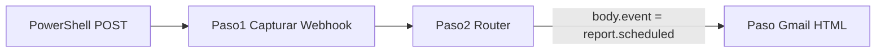

# Guía Activepieces — Reporte programado (`report.scheduled`)

Automatización del correo cuando el cron ejecuta reportes programados (**HU-KPI-010**).

La app dispara este evento desde `POST /api/cron/reports` con un payload JSON. Activepieces recibe el webhook, enruta por `event` y envía el correo a los destinatarios configurados.

**Importante:** hoy el cron **no adjunta** el archivo PDF/Excel/PPT. El correo notifica que el reporte se ejecutó y dirige al destinatario a `/reportes` en la app para exportar manualmente.

---

## Payload que envía la app

| Campo | Ejemplo | Uso en el correo |
|-------|---------|------------------|
| `event` | `report.scheduled` | Rama del Router |
| `timestamp` | ISO 8601 | Pie del correo |
| `scheduleId` | UUID | Trazabilidad (opcional en pie) |
| `nombre` | `Reporte semanal KPIs` | Título y asunto |
| `formato` | `pdf` / `excel` / `pptx` | Tabla de detalle |
| `emails` | `["a@x.com","b@x.com"]` | Campo **Para** de Gmail |
| `rowCount` | `42` | Cantidad de indicadores |

### Ejemplo completo

```json
{
  "event": "report.scheduled",
  "timestamp": "2026-06-24T10:00:00.000Z",
  "scheduleId": "sched-001",
  "nombre": "Reporte semanal KPIs",
  "formato": "pdf",
  "emails": ["gerente@estelar.com"],
  "rowCount": 42
}
```

---

## Qué es el paso 1 (Capturar Webhook)

Piensa en el paso 1 como una **buzón con dirección**:

- La **URL** es la dirección del buzón.
- Cuando la app (o tú desde consola) envía un JSON, Activepieces lo guarda en `body`.
- Recién **después** de eso puedes usar `body.event`, `body.nombre`, etc. en el Router y en Gmail.

Lo que ves en el paso 1 al crear el flow es **normal**: solo muestra la URL. Los campos como `event`, `nombre`, `formato`, etc. **no aparecen** hasta que envías datos a esa URL.

### URL viva vs URL de prueba

| Tipo | Ejemplo |
|------|---------|
| URL viva | `https://cloud.activepieces.com/api/v1/webhooks/H9xxxxx` |
| URL test | `https://cloud.activepieces.com/api/v1/webhooks/H9xxxxx/test` |

Usa la de `/test` para practicar en el editor sin depender del flow publicado.

---

## Cómo hacer que aparezcan los datos (3 pasos)

### Paso A — Publica el flow

Arriba a la derecha: **Publicar** (o **Publish**).

Sin publicar, la URL viva a veces no funciona bien.

### Paso B — Copia la URL de prueba

Agrega `/test` al final de la URL del webhook.

### Paso C — Envía el JSON desde PowerShell

Abre PowerShell y pega esto (cambia la URL por la tuya con `/test` al final):

```powershell
$url = "https://cloud.activepieces.com/api/v1/webhooks/TU_ID_AQUI/test"
$body = @'
{
  "event": "report.scheduled",
  "timestamp": "2026-06-24T10:00:00.000Z",
  "scheduleId": "sched-001",
  "nombre": "Reporte semanal KPIs",
  "formato": "pdf",
  "emails": ["marianaam634@gmail.com"],
  "rowCount": 42
}
'@
Invoke-RestMethod -Uri $url -Method POST -ContentType "application/json" -Body $body
```

Si responde sin error, ya enviaste datos al buzón.

---

## Dónde ver los datos después del POST

En Activepieces, vuelve al paso **1. Capturar Webhook** y busca uno de estos:

- Botón **Probar** / **Test** / **Generar datos de ejemplo**, o
- Panel a la derecha con el árbol `body` → `event`, `body` → `nombre`, etc., o
- Menú **Runs** (ejecuciones) → abre la última → clic en el paso 1 y ahí ves el `body`.

Si no ves nada en el editor, mira **Runs**: ahí casi siempre está el JSON que llegó.

---

## Flujo completo

```
Tú (consola)  ──POST JSON──►  URL /test del webhook
                                    │
                                    ▼
                         Paso 1 guarda todo en body
                                    │
                                    ▼
                         Paso 2 Router lee body.event
                           "report.scheduled" → rama reporte
                                    │
                                    ▼
                         Paso Gmail usa body.nombre, body.formato...
```



---

## Router — rama `report.scheduled`

Si usas el flow único con Router (ver [activepieces-workflows.md](./activepieces-workflows.md)):

1. Añade una rama en la pieza **Router**.
2. Condición: `body.event` **igual a** `report.scheduled` (texto exacto, con punto).
3. En esa rama, conecta el paso **Gmail → Enviar Email**.

| Rama | Condición | Acción |
|------|-----------|--------|
| Reporte programado | `event` = `report.scheduled` | Ver esta guía (paso Gmail) |

En el editor de expresiones, el cuerpo del webhook suele estar en `{{trigger.body}}` o `{{step_1.body}}` según la versión.

---

## Paso Gmail — configuración mínima (texto plano)

Cuando ya tengas datos de `report.scheduled` en el paso 1:

| Campo | Qué poner |
|-------|-----------|
| **Para** | Selecciona en el panel: `1. Capturar Webhook` → `body` → `emails` |
| **Asunto** | `Reporte programado — ` + `body` → `nombre` |
| **Cuerpo** | `body` → `nombre` + salto de línea + `Formato: ` + `body` → `formato` + salto de línea + `Indicadores: ` + `body` → `rowCount` |

No escribas `{{trigger.body...}}` a mano al principio: haz clic en el panel izquierdo y elige cada campo. Así no te equivocas.

---

## Paso Gmail — plantilla HTML (cuerpo bonito)

En **Gmail → Enviar Email**:

1. En **Tipo de cuerpo**, cambia de texto plano a **HTML** (a veces aparece como `html`).
2. Pega la plantilla de abajo en el campo **Cuerpo**.
3. Sustituye cada `{{...}}` usando el selector de datos del paso 1 (`body` → `nombre`, `body` → `formato`, etc.).

### Plantilla HTML — reporte programado (`report.scheduled`)

```html
<!DOCTYPE html>
<html lang="es">
<head>
  <meta charset="UTF-8">
  <meta name="viewport" content="width=device-width, initial-scale=1.0">
</head>
<body style="margin: 0; padding: 0; background-color: #f1f5f9; font-family: Arial, Helvetica, sans-serif;">
  <table role="presentation" width="100%" cellspacing="0" cellpadding="0" style="background-color: #f1f5f9; padding: 32px 16px;">
    <tr>
      <td align="center">
        <table role="presentation" width="600" cellspacing="0" cellpadding="0" style="max-width: 600px; background-color: #ffffff; border-radius: 8px; overflow: hidden; box-shadow: 0 2px 8px rgba(0,0,0,0.06);">
          <!-- Encabezado -->
          <tr>
            <td style="background-color: #1e3a5f; padding: 24px 32px;">
              <p style="margin: 0; color: #94a3b8; font-size: 12px; letter-spacing: 1px; text-transform: uppercase;">Sistema KPIs Estelar</p>
              <h1 style="margin: 8px 0 0; color: #ffffff; font-size: 20px; font-weight: bold;">Reporte programado</h1>
            </td>
          </tr>
          <!-- Mensaje principal -->
          <tr>
            <td style="padding: 32px;">
              <p style="margin: 0 0 20px; color: #334155; font-size: 15px; line-height: 1.6;">
                Su reporte programado está listo para consulta.
              </p>
              <!-- Tabla de detalle -->
              <table role="presentation" width="100%" cellspacing="0" cellpadding="0" style="border: 1px solid #e2e8f0; border-radius: 6px; margin-bottom: 28px;">
                <tr style="background-color: #f8fafc;">
                  <td style="padding: 12px 16px; color: #64748b; font-size: 13px; width: 140px; border-bottom: 1px solid #e2e8f0; font-weight: bold;">Reporte</td>
                  <td style="padding: 12px 16px; color: #1e293b; font-size: 14px; border-bottom: 1px solid #e2e8f0;">{{step_1.body.nombre}}</td>
                </tr>
                <tr>
                  <td style="padding: 12px 16px; color: #64748b; font-size: 13px; font-weight: bold;">Formato</td>
                  <td style="padding: 12px 16px; color: #1e293b; font-size: 14px; text-transform: uppercase;">{{step_1.body.formato}}</td>
                </tr>
                <tr style="background-color: #f8fafc;">
                  <td style="padding: 12px 16px; color: #64748b; font-size: 13px; font-weight: bold;">Indicadores</td>
                  <td style="padding: 12px 16px; color: #1e293b; font-size: 14px;">{{step_1.body.rowCount}}</td>
                </tr>
              </table>
              <!-- Botón -->
              <table role="presentation" cellspacing="0" cellpadding="0">
                <tr>
                  <td style="border-radius: 6px; background-color: #1e3a5f;">
                    <a href="https://tu-app.vercel.app/reportes"
                       target="_blank"
                       style="display: inline-block; padding: 14px 28px; color: #ffffff; font-size: 14px; font-weight: bold; text-decoration: none;">
                      Ver reportes →
                    </a>
                  </td>
                </tr>
              </table>
              <p style="margin: 24px 0 0; color: #94a3b8; font-size: 12px; line-height: 1.5;">
                El archivo no va adjunto en este correo. Entre a Reportes en la app para exportar en PDF, Excel o PowerPoint.<br>
                Si el botón no funciona, copie este enlace en su navegador:<br>
                <a href="https://tu-app.vercel.app/reportes" style="color: #3b82f6; word-break: break-all;">https://tu-app.vercel.app/reportes</a>
              </p>
            </td>
          </tr>
          <!-- Pie -->
          <tr>
            <td style="background-color: #f8fafc; padding: 16px 32px; border-top: 1px solid #e2e8f0;">
              <p style="margin: 0; color: #94a3b8; font-size: 11px; text-align: center;">
                Notificación automática · {{step_1.body.timestamp}}<br>
                Programación: {{step_1.body.scheduleId}}<br>
                No responda a este correo.
              </p>
            </td>
          </tr>
        </table>
      </td>
    </tr>
  </table>
</body>
</html>
```

### Cómo mapear los campos en Activepieces

No escribas `{{step_1.body.nombre}}` a mano si no estás seguro: haz clic en el campo del cuerpo HTML y, en el panel izquierdo, elige:

| En el HTML | Selecciona en el panel |
|------------|----------------------|
| Nombre del reporte | `1. Capturar Webhook` → `body` → `nombre` |
| Formato | `body` → `formato` |
| Indicadores incluidos | `body` → `rowCount` |
| Fecha pie | `body` → `timestamp` |
| ID programación | `body` → `scheduleId` |
| Botón y enlace de respaldo | Texto fijo: tu URL de app + `/reportes` (ej. valor de `NEXT_PUBLIC_APP_URL`) |

| Campo Gmail | Valor |
|-------------|-------|
| **Para** | `body` → `emails` |
| **Asunto** | `Reporte programado — ` + `body` → `nombre` |

### Antes de probar

Envía el JSON de prueba con `"event": "report.scheduled"` (consola o URL `/test`), **no** el de alerta ni el de recordatorio. Si no, los campos salen vacíos.

### Detalles útiles

- **Sin adjunto:** el cron cuenta indicadores (`rowCount`) pero no genera el archivo; el botón lleva a `/reportes`.
- **`rowCount` en 0:** el cron corrió pero no había KPIs con esos filtros; el correo puede enviarse igual.
- **Estilos inline:** Gmail ignora mucho CSS externo; por eso todo va en `style=""`.
- **Tablas:** se usan `<table>` porque Gmail las renderiza mejor que `<div>`.
- **Botón:** algunos clientes lo muestran como enlace azul; por eso va el enlace de respaldo debajo.

---

## Errores muy comunes

| Problema | Solución |
|----------|----------|
| Paso 1 solo muestra la URL | Normal. Falta enviar el POST con `/test`. |
| Campos vacíos en Gmail | Enviaste otro `event` (ej. `kpi.review.due` o `kpi.alert.created`). |
| No pasa nada al POST | Flow no publicado, URL mal copiada, o falta `/test`. |
| Va a rama incorrecta | En Router: `body.event` igual a `report.scheduled` (texto exacto). |
| `rowCount` es 0 | No había KPIs con los filtros del reporte; revisa datos en la app. |

---

## Prueba end-to-end

### 1. Prueba en el editor (recomendado primero)

1. Publica el flow (o usa URL `/test`).
2. Ejecuta el comando PowerShell de arriba.
3. Abre **Runs** y verifica que la rama `report.scheduled` se ejecutó.
4. Revisa que el correo llegó con nombre, formato e indicadores.

### 2. Prueba con el cron real

Cuando el flow esté publicado y `ACTIVEPIECES_WEBHOOK_URL` esté en `.env.local`:

```bash
curl -X POST "https://tu-app.vercel.app/api/cron/reports" \
  -H "Authorization: Bearer TU_CRON_SECRET" \
  -H "Content-Type: application/json"
```

Requisitos:

- Al menos un reporte activo en `scheduled_reports` (UI en `/reportes`).
- `ACTIVEPIECES_WEBHOOK_URL` configurada en el entorno del servidor.

Verifica la ejecución en **Runs** del flow en Activepieces.

---

## Resumen en una frase

El paso 1 no genera datos solo: debes enviar el JSON con `"event": "report.scheduled"` a la URL (con `/test`) y entonces Activepieces te muestra `body` para usarlo en Gmail.

---

## Ver también

- [activepieces-workflows.md](./activepieces-workflows.md) — flow global con Router, configuración de `.env.local` y resto de eventos.
